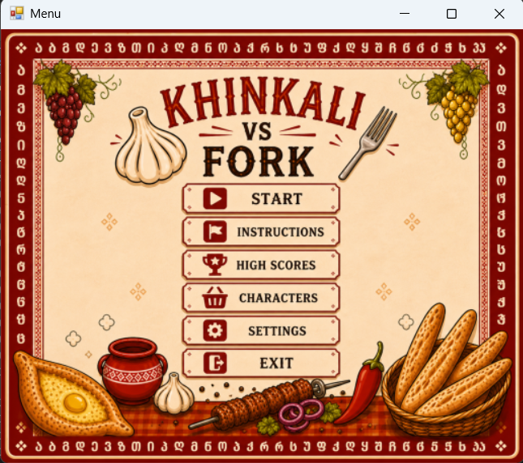
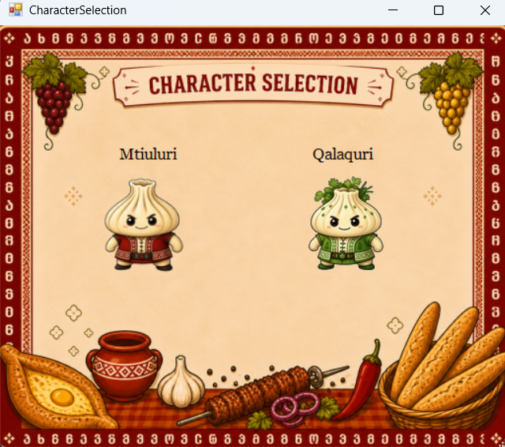
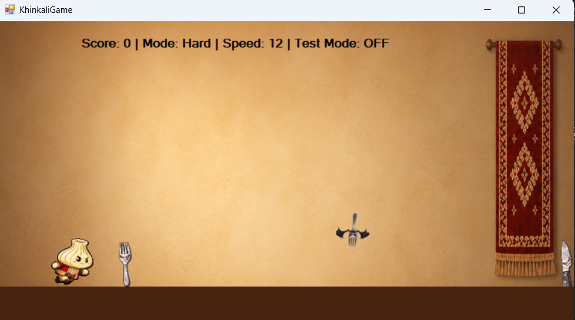
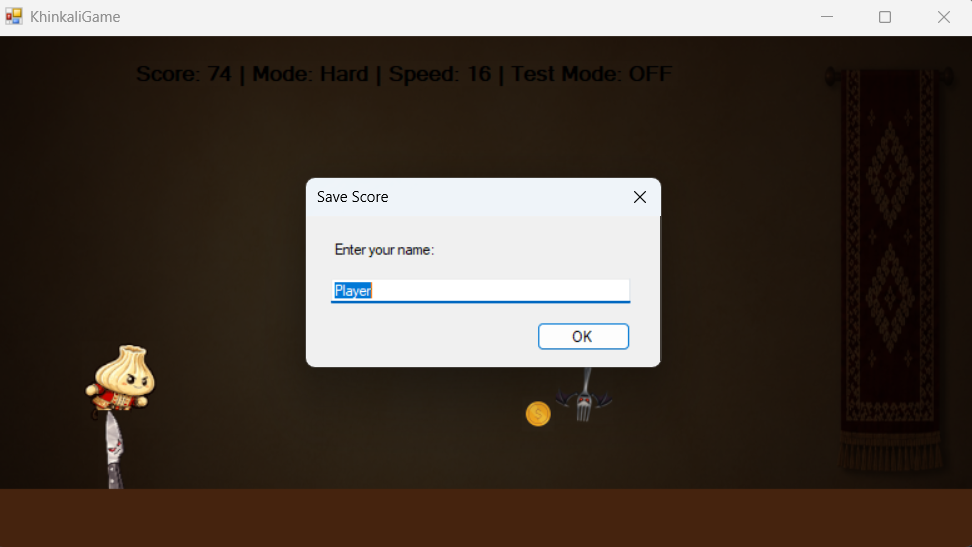
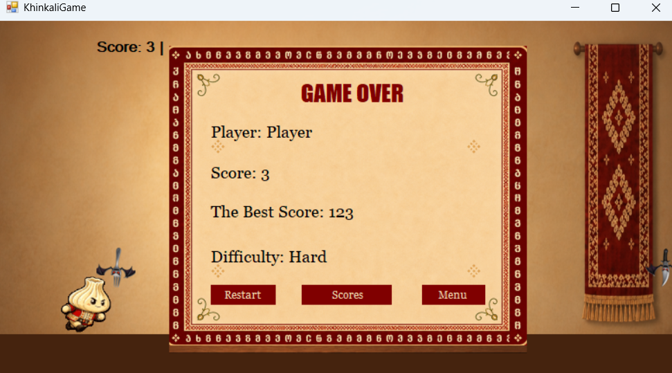
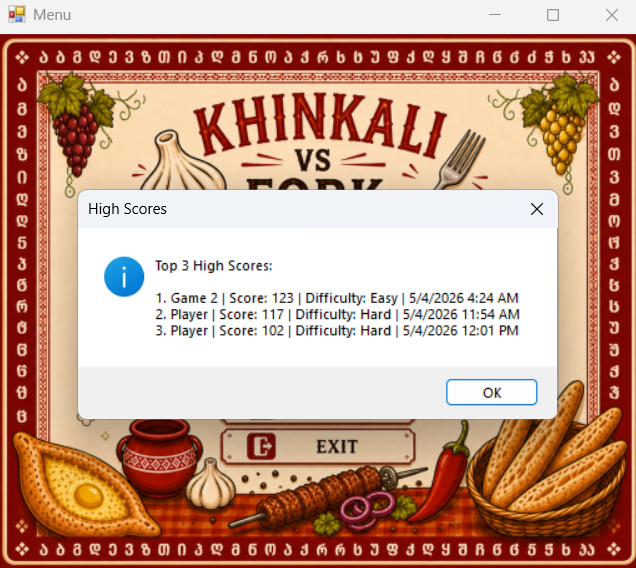

# 🥟 Khinkali VS Fork

**Khinkali VS Fork** is a C# Windows Forms endless runner game developed as a university programming project.

> **Note:** This project was originally developed as a university assignment, so the source code contains more detailed comments and documentation than a typical portfolio project.

The player controls a khinkali character and avoids fork and knife obstacles while earning points, progressing through different difficulty levels, and collecting coins during night mode.

## 🎮 Features

- Character selection
- Easy, Medium, and Hard difficulty modes
- Jumping and ducking mechanics
- Ground and flying obstacles
- Pause and game over screens
- High score saving and ranking
- 🌙 Dynamic day and night mode
- 🪙 Coin collection with bonus points during night mode
- Collision detection
- Difficulty-based speed and obstacle behavior

## 🛠️ Technologies

## 📸 Application Preview

<table>
  <tr>
    <td align="center" valign="top">
      <strong>Main Menu</strong>  
      
    </td>
    <td align="center" valign="top">
      <strong>Character Selection</strong>  
      
    </td>
  </tr>

  <tr>
    <td align="center" valign="top">
      <strong>Gameplay</strong>  
      
    </td>
    <td align="center" valign="top">
      <strong>🌙 Night Mode & Coin Collection</strong>  
      
    </td>
  </tr>

  <tr>
     <td align="center" valign="top">
      <strong>Game Over</strong>  
      
    </td>
     <td align="center" valign="top">
      <strong>High Scores</strong>  
      
    </td>
  </tr>
</table>

## 🧠 Programming Concepts Used

- Object-oriented programming
- Inheritance and polymorphism
- Abstract classes
- Interfaces
- Event-driven programming
- File input/output
- Collections
- Collision detection
- Game state management

